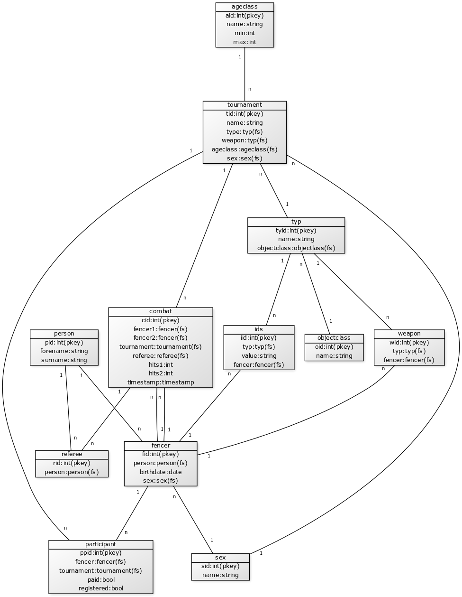

```
[fencer|fid:int(pkey);person:person(fs);birthdate:date;sex:sex(fs)]n-1[sex|sid:int(pkey);name:string], [participant|ppid:int(pkey);fencer:fencer(fs);tournament:tournament(fs);paid:bool;registered:bool]n-1[tournament|tid:int(pkey);name:string;type:typ(fs);weapon:typ(fs);ageclass:ageclass(fs);sex:sex(fs)],[sex]1-n[tournament],[fencer]1-n[participant],[tournament]1-n[combat|cid:int(pkey);fencer1:fencer(fs);fencer2:fencer(fs);tournament:tournament(fs);referee:referee(fs);hits1:int;hits2:int;timestamp:timestamp], [combat]1-n[referee|rid:int(pkey);person:person(fs)],[person|pid:int(pkey);forename:string;surname:string;]1-n[fencer],[person]1-n[referee],[ageclass|aid:int(pkey);name:string;min:int;max:int]1-n[tournament],[ids|iid:int(pkey);typ:typ(fs);value:string;fencer:fencer(fs)]n-1[fencer],[weapon|wid:int(pkey);typ:typ(fs);fencer:fencer(fs)]n-1[fencer],[typ|tyid:int(pkey);name:string;objectclass:objectlass(fs)]n-1[objectclass|oid:int(pkey);name:string],[typ]1-n[ids],[typ]1-n[weapon],[combat]n-1[fencer],[combat]n-1[fencer],[tournament]n-1[typ]```
